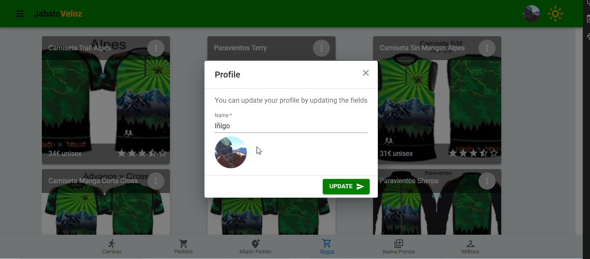

# Jabato Veloz || JV App

Es una aplicación para gestionar los pedidos de ropa de los integrantes del equipo deportivo.

## MERN App

- Backend creado a partir de una MongoDB y un servidor de Express
- Frontend creado con React y Materia UI

## Roles

- Admin --> Un admin solo se puede crear desde una herramienta de testeo de APIs. Un admin podrá

  - Crear pedidos
  - Añadir productos
  - Ver productos
  - Crear órdenes de compra
  - Visualizar y actualizar sus ordenes de compra
  - Eliminar una orden de compra

- user --> Un usuario podrá:
  - Ver productos
  - crear órdenes de compra
  - Visualizar y actualizar sus ordenes de compra
  - Eliminar una orden de compra

## Configuracion

### Backend

#### 1. Conexion a MongoDB

Se debe crear una base de datos de mongo y generar un fichero .env con las siguentes variables:

- DB_URL

#### 2. Autenticación con JWT

Se debe crear en el .env las siguentes variables:

- SECRET_KEY
- JWT_SECRET

#### 3. Repositorio de imagenes Cloudinary

Se debe tener una cuenta en claudinary y crear en el .env las variables:

- APY_KEY
- CLOUD_NAME
- API_SECRET
- PRJ_NAME --> Nombre de la carpeta que se va a generar en cloudinary para almacenar las imágenes en subdirectorios en función de la procedencia de la pretición (productos o users)

### Frontend

#### 1. Base url

VITE_BaseName = 'http://localhost:3000'

## Insertar datos en la DB

### 1. Obtener imágenes de productos

Una vez se ha clonado el repositorio, se deben descargar la carpeta de imágenes de los productos con los que se nutrirá la base de datos. El enlace es el siguiente: [Descargar imagenes](https://mega.nz/file/tN1m1SLa#z0Fp2yoJcxYDvdZPKpRVU6vjO6foVxKDamf12F3H0Vs)

Esta carpeta se debe descomprimir y almacenar anidado justo debajo de la carpeta "server" del backend

### 2. crear datos desde semilla

Se dispone de una semilla en el directorio server/src/utils/Productos/seedingAppData.js

En el package.json esta definido el comando "SeedingData" que permite ejecutar la semila mediante "npm run SeedingData"

Esta semilla creará:

- 10 usuarios con distitnos roles
- 28 productos
- 2 pedidos
- 20 ordenes de ropa asignadas la mitad a cada uno de los pedidos.

## Deployment link

### 1. Render

#### Client inside Server deploy

https://jabatoveloz.onrender.com

### 2. Vercel links

#### 1. server side deploy

https://jabatoveloz-backend.vercel.app

#### 2. client side deploy

https://jabato-veloz.vercel.app/
